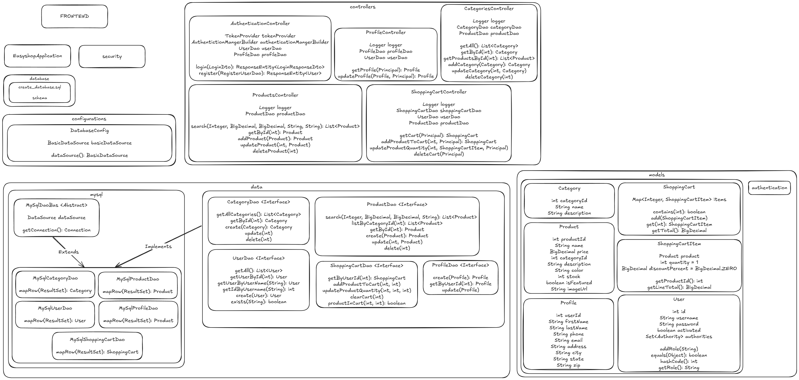
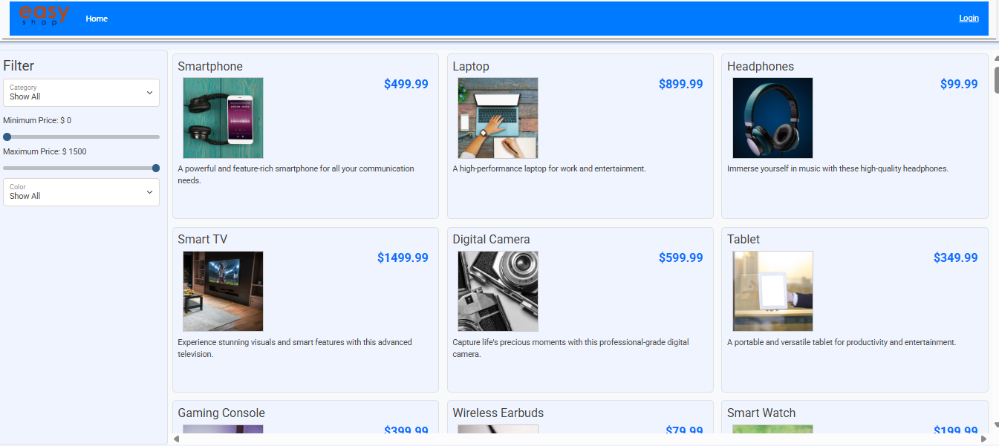
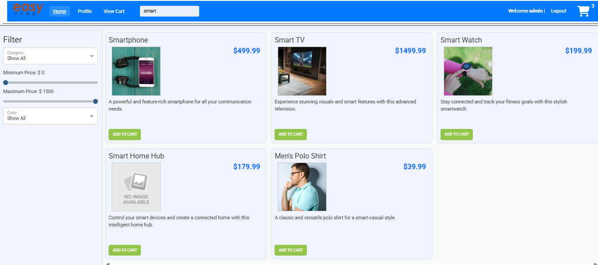
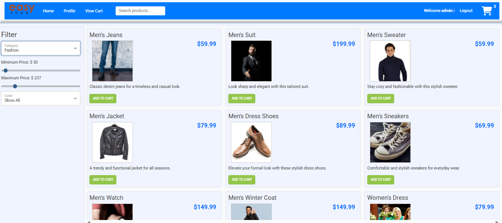
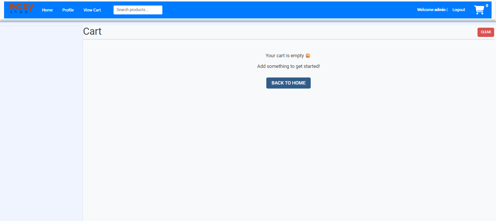
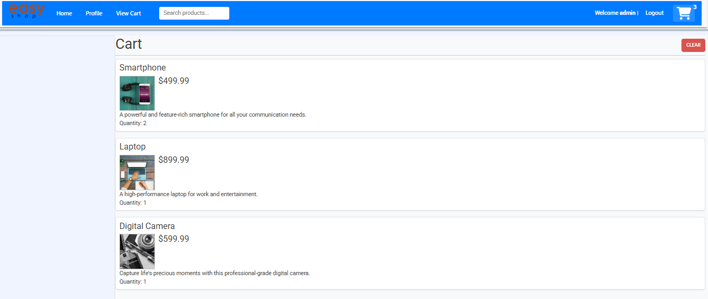
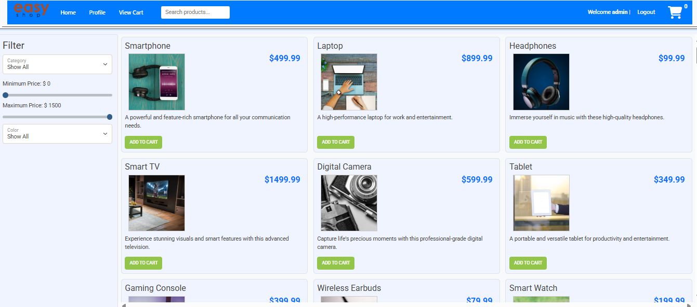
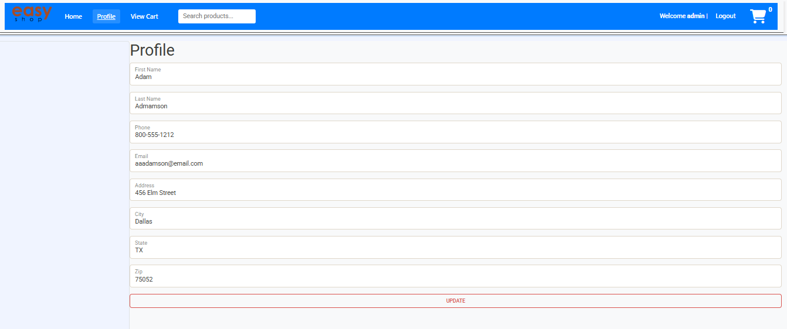

# 🛒 EasyShop - Fullstack Shopping App

Welcome to **EasyShop**, your one-stop shop for a seamless online shopping experience! This README covers both the **frontend** and **backend** of the app — the dynamic duo that makes EasyShop tick! ⚡️

---

## 🧩 UML Diagram

The following UML diagram illustrates the structure and interaction between key components of the system.

---

## ✨ Features

- **User Registration and Authentication** (Spring Security)
- **Product Catalog** with CRUD operations
- **Shopping Cart**: Add, update, view, and clear cart items
- **User Profile Management**: View and update user profile information

---

## 📸 Screenshots

### 🏠 Default Page
This is the homepage users see when they first land on the site.

---

### 🔍 Search Bar
Users can search for products using a dynamic search bar.

---

### 🎯 Using Filters
Filtering products by category, price, or other options.

---

### 🛒 Shopping Cart (Empty)
An empty shopping cart when no items are added.

---

### 🛒 Shopping Cart (With Items)
A preview of the cart after items have been added.

---

### 🔐 Logged In Page
After logging in, users access personalized features.

---

### 👤 Profile Page
User's profile showing personal information and preferences.

---

## 🖥️ Frontend Overview

The frontend is a sleek, responsive UI built with vanilla JS, Mustache templates, Bootstrap styles, and Axios for API calls. It’s what users interact with directly to browse products, filter categories, manage their profiles, and shop with ease.

### 🎯 What I Worked On

I focused mainly on:

- 🧩 **Products**: Displaying product listings, product detail modals, and handling search/filter functionality
- 🧃 **Categories**: Loading and managing product categories dynamically to filter products easily
- 🔍 **Search**: Implemented a live product search bar that filters items in real time as the user types
- 👤 **Profile**: Built the profile page and added the ability for users to update their personal info
- 🎨 **UI Polish**: Improved overall user interface styling and layout for a cleaner, more modern experience (header styles, buttons, cart animations, and more)

*(Note: Other foundational parts were provided — I focused on adding the above features!)*

The rest of the app, including authentication, cart UI, error handling, and some services, were provided as part of the base project.

### 🛠️ Frontend Tech Stack

- Vanilla JavaScript + ES6 classes
- [Mustache.js](https://mustache.github.io/) for templating
- Axios for AJAX API calls
- Bootstrap for styling & responsive components
- FontAwesome icons for UI flair

### ⚡ Key Frontend Features

- Dynamic templates loaded via AJAX and rendered with Mustache
- Product filtering by category, price range, and color
- Modal popups for product image details and login forms
- Live cart item count in header with animated item addition
- Profile form with data-binding and update capability

---

## ⚙️ Backend Overview

The backend is the engine room running the EasyShop app’s business logic, data management, and security. It exposes RESTful APIs consumed by the frontend.

### 🔑 Core Responsibilities

- Product and category management (CRUD & filtering)
- User authentication (login/logout) & profile management
- Shopping cart management with session or token persistence
- Secure, validated API endpoints with proper error handling

### 🛠️ Backend Tech Stack

- Node.js with Express.js framework
- Database: SQL
- JWT or session-based authentication
- Middleware for logging, validation, CORS, and security

### 🗂️ Backend Structure (Typical)

- /controllers # API handlers for products, users, cart, etc.
- /models # DB schema definitions
- /routes # Express routing to controllers
- /middleware # Auth, error handling, logging
- /services # Business logic layer
- /config # Environment & app config
- app.js # Server bootstrap
- package.json # Dependencies & scripts

---

## 🚀 Getting Started

### 1. Backend

- Clone or download the repo
- Install Node.js and your database
- Run `npm install` in the backend directory
- Configure `.env` file with DB connection and JWT secrets
- Start backend server with `npm start` (default: `http://localhost:8080`)

### 2. Frontend

- Serve the frontend files via any static server or live server plugin
- The frontend communicates with backend APIs at the configured `baseUrl`
- Open the main HTML page in a browser to start shopping!

---

## 📡 API Endpoints (Sample)

- `GET /products` — Fetch all products
- `GET /categories` — Fetch product categories
- `POST /login` — Authenticate user
- `GET /profile` — Retrieve user profile
- `PUT /profile` — Update user profile
- `POST /cart` — Add item to cart
- `DELETE /cart` — Clear cart

---

## 🎉 Final Notes

- Frontend and backend are loosely coupled via clean RESTful APIs
- Designed for scalability, easy maintenance, and smooth UX
- Friendly error messages and alerts for users
- Modular code with reusable components and services

---

## ⚠️ Disclaimer

This project was developed for **educational and demonstration purposes only**. While it simulates a functional e-commerce platform with features like authentication, product browsing, filtering, and cart management, it is **not intended for real-world commercial deployment**.

The codebase is simplified to focus on learning key full-stack development concepts. As such:

- 🔒 **Security** measures (e.g., token storage, password hashing, input sanitization) are implemented at a basic level and may not be suitable for production environments.
- 🛠️ **Error handling**, **validation**, and **edge case management** are intentionally minimal for clarity.
- 🗃️ **Data persistence** and user session management are not optimized for scalability or resilience.

Use or modify this software at your own risk. The maintainers are not liable for any issues, data breaches, or damage that may occur from using this code.

> 💡 Always implement proper security practices, conduct thorough testing, and ensure compliance with privacy laws before using similar systems in real-world applications.

---

## 📜 License

MIT License — use it, modify it, and have fun shopping! 🎉🛍️

---

If you want help customizing, running, or extending EasyShop, just ask! 🚀

# 🧑‍💻 Author
💻 Developed by: Meixin Zhang

📅 Date: June 26th, 2025

Created with ❤️ using Java.